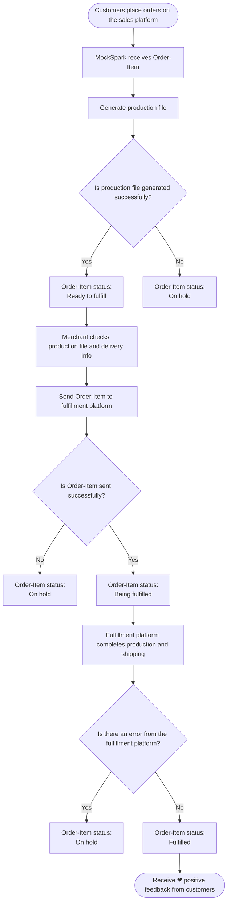

import { ColorText } from "/snippets/color-text.mdx"

## What is a Order-Item?
When a customer places a customized product order through your store and completes payment, the order is automatically synced with MockSpark. Once we receive the order details, we break it down by product into smaller sub-orders, which we refer to as **Order Items**.

Breaking down a single order into multiple **Order-Items** offers several key benefits:
1. A single order may include both customizable products fulfilled by MockSpark and other unrelated products sold in your store. Since we don’t handle those unrelated items, automatically filtering them out helps simplify order management and reduce confusion for you.
2. If a customer places one order for a T-shirt and later places another order for a hat, and both items are fulfilled through the same platform (such as Printify), we can now consolidate these Order Items based on the shipping address before sending them to the fulfillment provider. This significantly reduces shipping costs by avoiding duplicate shipment fees for items going to the same customer.
3. If an order contains an item that is out of stock or has another issue, we can easily move forward with fulfilling the available items without requiring you to manually split the order. This helps ensure faster fulfillment and reduces the risk of losing the entire order.

Go to the **Order Items** section from the top navigation bar.
<Frame>
  
</Frame>

搜索区域支持以下6种查询条件：
1. Shopify Order Name
2. Order Create At
3. Product Title
4. Customer Email
5. Fulfillment Platform
6. Status

在搜索区域中先输入你的查询条件，再点击**Search**按钮开始搜索。
<Frame>
  
</Frame>

列表中的每一行代表一个Order Item, 点击该行可以跳转到对应的 Order Item 详情页
<Frame>
  
</Frame>

1. 在列表页勾选你需要的 Order Items
2. 对你勾选的 Order Items 进行批量提交履行，或者导出CSV格式的数据
<Frame>
  
</Frame>

在 Order Item 详情页的头部，你可以看到该Order-Item的基础信息，包括创建时间、Order-Item status等
<Frame>
  
</Frame>

在 Store 模块，你可以看到该 Order Item 在销售平台(例如shopify)中的各种信息
<Frame>
  
</Frame>

在 Store 模块的左侧，你可以看到该 Order Item 的 Notes、Customer、Shipping Method等信息，如果客户在销售平台(例如shopify)中修改了 Notes、Customer等信息，可以点击 **Sync** 按钮进行同步更改。
<Frame>
  
</Frame>

选择**Redesign**会弹出包含该 Order Item 的设计信息的`Product Personalizer`，可以在`Product Personalizer`中对该 Order Item 的设计进行调整
<Frame>
  
</Frame>

1. 除了在`Product Personalizer`中对该 Order Item 的设计进行调整，也可以点击变体框，切换该 Order Item 对应的变体
2. 选择 **Save design** 进行保存
<Frame>
  
</Frame>

1. 选择 **Send to Fulfill**
2. 在弹框中选择你要用来履行该 Order Item 的 Printify store（不同的履行平台这里的交互会有差异）
3. 点击弹框中的 **Send to Fulfill**，将该 Order Item 推送给履行平台
<Frame>
  
</Frame>

点击 **Move actions**，可以在下来框中看到更多的功能，包括：
1. Export CSV
2. Download production files
3. Manually mark as fulfilled
4. Cancel order
5. Archive
<Frame>
  
</Frame>

在 Fulfillment 模块，你可以看到该 Order Item 在履行平台(例如printify)中的各种信息
<Frame>
  
</Frame>

在 Timeline 模块，你可以看到该 Order Item 的操作和变更记录
<Frame>
  
</Frame>

## Status of Order-Item Explained
status: <ColorText color="#3b82f6" text="Generating" />
<ColorText color="#eab308" text="Ready to fulfill" />
 
<ColorText color="#3b82f6" text="Sending" />
 
<ColorText color="#3b82f6" text="Being fulfilled" />
 
<ColorText color="#22c55e" text="Fulfilled" />
 
<ColorText color="#ef4444" text="On hold" />
 
<ColorText color="#6b7280" text="Canceled" />
 
<ColorText color="#6b7280" text="Archived" />

## Order-Item Process

